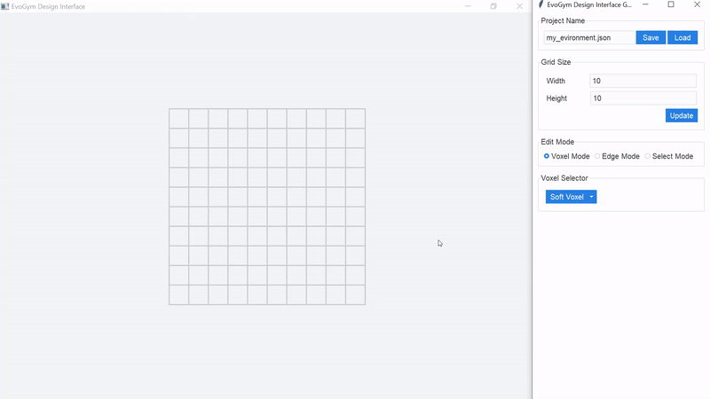

# Evolution Gym

Evolution Gym is a large-scale benchmark for co-optimizing the design and control of soft robots. It provides a lightweight soft-body simulator wrapped with a gym-like interface for developing learning algorithms. Evogym also includes a suite of 32 locomotion and manipulation tasks, detailed on our [website](https://evolutiongym.github.io/all-tasks). Task suite evaluations are described in our [NeurIPS 2021 paper](https://arxiv.org/pdf/2201.09863).

> [!NOTE]
> Evogym has been recently updated! TLDR: requirements have been modernized, and the library is now pip-installable.

[//]: # ()


# Installation

To use evogym, simply run:

```shell
pip install --upgrade evogym
```

> [!CAUTION]
> This doesn't work yet -- coming soon! For now, you can install from test pypi:
> ```shell
> pip install "numpy<2.0.0" gymnasium
> pip install -i https://test.pypi.org/simple/ evogym
> ```

## From Source

If your platform is not supported, you may try building from source:

### Requirements

* Python 3.7+
* Linux, macOS, or Windows with [Visual Studios 2017](https://visualstudio.microsoft.com/vs/older-downloads/) build tools.
* [CMake](https://cmake.org/download/)

Clone the repo and submodules:

```shell
git clone --recurse-submodules https://github.com/EvolutionGym/evogym.git
```

On **Linux only**:

```shell
sudo apt-get install xorg-dev libglu1-mesa-dev
```

Finally, to install `evogym`, run the following command in the environment of your choice:

```shell
pip install -e .
```

## Test Installation

If you have the repo cloned, `cd` to the `examples` folder and run the following script:

```shell
python gym_test.py
```

Alternatively, you can run the following snippet:

```python
import gymnasium as gym
import evogym.envs
from evogym import sample_robot


if __name__ == '__main__':

    body, connections = sample_robot((5,5))
    env = gym.make('Walker-v0', body=body, render_mode='human')
    env.reset()

    while True:
        action = env.action_space.sample()
        ob, reward, terminated, truncated, info = env.step(action)

        if terminated or truncated:
            env.reset()

    env.close()
```

This script creates a random `5x5` robot in the `Walking-v0` environment. The robot is taking random actions. A window should open with a visualization of the environment -- kill the process from the terminal to close it.

# Usage


## Tutorials

You can find tutorials for getting started with the codebase on our [website](https://evolutiongym.github.io/tutorials). Completed code from all tutorials is also available in the `tutorials` folder, along with a `README`. Tutorials are included for:
- Using the [evogym API](https://evolutiongym.github.io/tutorials/basic-api.html)
- Making a [custom evogym environment](https://evolutiongym.github.io/tutorials/new-env.html)
- Supported [rendering options](https://github.com/EvolutionGym/evogym/blob/main/tutorials/rendering_options.py)

## Examples

To run co-design and control optimization experiments in EvoGym, please see the `examples` folder and its `README`. Included are scripts for:
- Running PPO
- Running a Genetic Algorithm
- Running Bayesian Optimization
- Running CPPN-NEAT
- Visualizing results
- Saving results as gifs

Make sure you clone the repo with submodules:

```shell
git clone --recurse-submodules https://github.com/EvolutionGym/evogym.git
```

Install the necessary python requirements:
```shell
pip install -r requirements.txt
```

## Docs

You can find documentation on our [website](https://evolutiongym.github.io/documentation).

## Design Tool

The Design Tool provides a gui for creating Evolution Gym environments. Please see [this repo](https://github.com/EvolutionGym/evogym-design-tool).

[//]: # ()


# Dev

Install the repo with submodules:

```shell
git clone --recurse-submodules https://github.com/EvolutionGym/evogym.git
```

Install the necessary python requirements. You will additionally need to install the dev requirements:
```shell
pip install -r requirements.txt
pip install -r requirements-dev.txt
```

## Run Tests

From within the `tests` directory run the full test suite:

```shell
cd tests
pytest -s -v -n auto
```

Or the lite test suite:


```shell
cd tests
pytest -s -v -n auto -m lite
```

# Citation

If you find our repository helpful to your research, please cite our paper:

```
@article{bhatia2021evolution,
  title={Evolution gym: A large-scale benchmark for evolving soft robots},
  author={Bhatia, Jagdeep and Jackson, Holly and Tian, Yunsheng and Xu, Jie and Matusik, Wojciech},
  journal={Advances in Neural Information Processing Systems},
  volume={34},
  year={2021}
}
```
